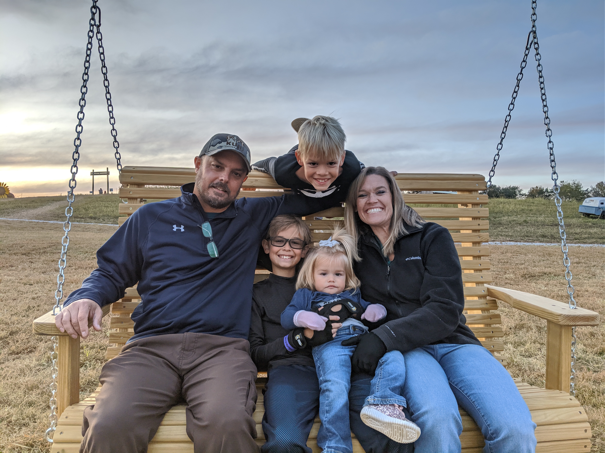

This is the personal web site of Bob Yexley. I am, first, a disciple of Jesus Christ, a husband to my amazing wife, Crystal, and finally, a father to three children that I dearly love. By trade I build software, mostly for the web, but I've done all kinds. I like building software, so I do it even in my spare times sometimes. I also enjoy reading, football and basketball, hunting and fishing, and have recently enjoyed getting into backpacking as well.

----

I built this site using [Gatsby](https://www.gatsbyjs.org/). I'm not great at design, so I used the fantastic [gatsby-starter-hero-blog](https://github.com/greglobinski/gatsby-starter-hero-blog) by [Greg Lobinski](https://www.greglobinski.com/) (great work Greg, and thanks) and adapted it to my own personal tastes. Gatsby with that starter definitely made a great jumping off point though. I'm happy with it (for now at least, heh).
