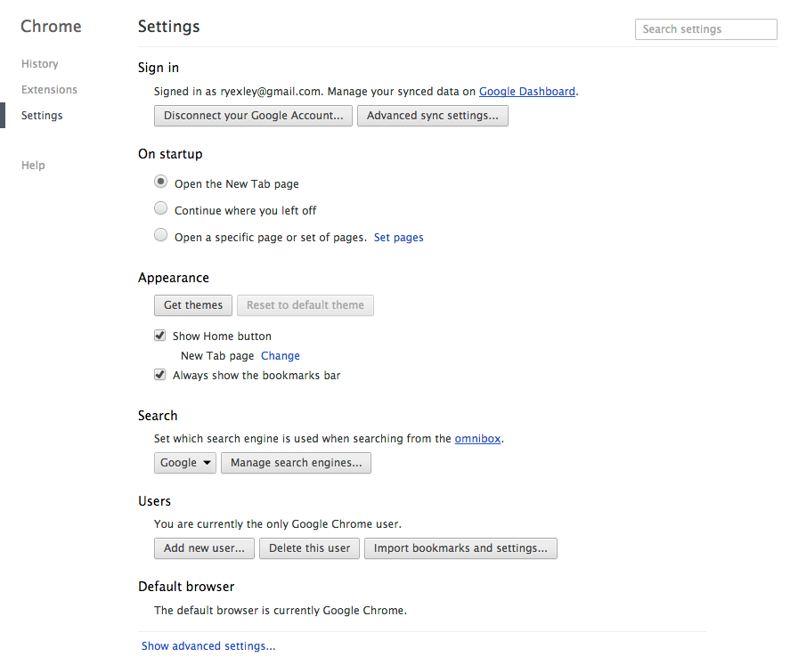
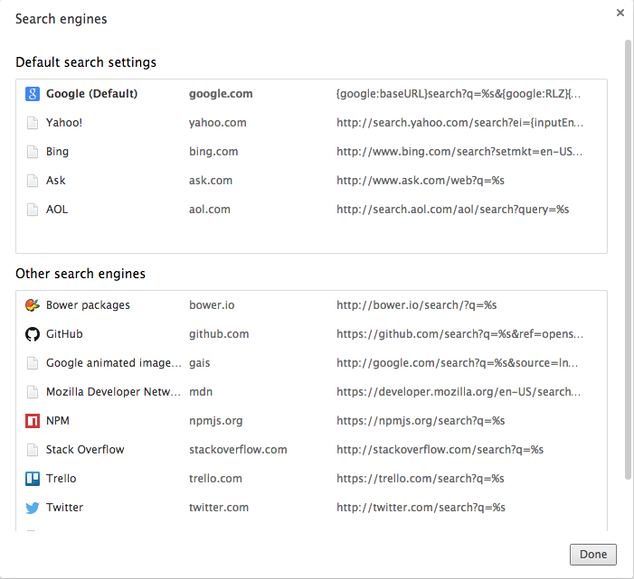

For a long time, text-based communications have used emoticons to express various emotions. More recently, at least in the nerd community in which I work, the use of animated gifs has become a popular means of going beyond emoticons.

The problem is...often times the challenge of finding the right animated gif in a timely manner is easier said than done. If you take too long, the moment has passed, and you just look lame sharing a reaction gif 10 minutes later.

In order to help improve my animated gif foo, I created for myself a custom animated gif search provider in Google Chrome. Chrome innovated the web browser by allowing users to use the address bar for more than just entering and manipulating URLs for navigating around the web, and allowed users to be able to enter search criteria into the address bar to search. It even went a step further by allowing users to create custom search providers to further focus searches from the address bar.

Here's how I created a custom search provider that allows me to almost instantaneously search in Google for animated gifs.

In Google Chrome, open up settings (Command+, in OS X).



Under the "Search" section, click on the "Manage search engines..." button, and you will see the following dialog:



Under the "Other search engines" panel, scroll to the bottom and you should see three empty fields that you can use to define a new custom search engine:


In the first field, enter some text to describe what the custom search engine is for...I called it "Google animated image search."

In the second field, add the keyword that you wish to type into the address bar to initialize the custom search...I used an acronym for the description: "gais."

In the last field, enter the following URL:

```
http://google.com/search?q=%s&source=lnms&tbm=isch&tbs=itp:animated
```

Click the "Done" button at the bottom, and you're done.

Now, whenever you want to quickly find an animated gif for the moment, just go to Google Chrome, and in the address bar type: `gais` and hit the Tab key, and then type the description for the kind of animated gif you wish to find.


Now you have no excuse. Go forth and be giffy.
