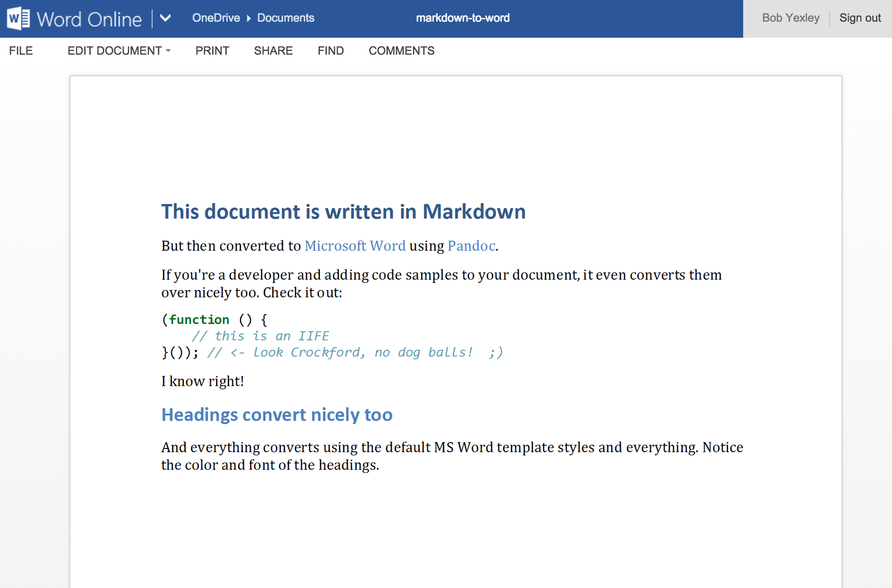

## TLDR

Install Pandoc with Homebrew:

```
$ brew install pandoc
```

Convert your Markdown file to Word (docx):

```
$ pandoc -o output.docx -f markdown -t docx markdown-file.md
```

____

To say that I'm not a fan of [Microsoft Office](http://office.microsoft.com/) would be an understatement. There are alternatives out there that I _much_ prefer. But, using Word is pretty much inescapable in todays world. _Everyone_ uses it.

My preferred method of authoring documents is to use [Markdown](http://daringfireball.net/projects/markdown/). Its a simple, plain-text format, and can be written in any plain editor, with with a number of different utilities, I can export a markdown file to a number of different universally accessible formats. One format that I'd never had a need to save to was Word. But that all changed very recently.

For a project I'm working on, the ultimate deliverable is Word document. I have to deliver what I'm writing in Word format. But I'm actually writing everything in Markdown. So I was hoping to find a way to be able to somehow convert a Markdown file to a Word document.

I was _really_ pleasantly surprised that, after about 15 minutes on Google, I was able to find a way to do just that, and I was _very_ impressed with the results.

## Pandoc

> _If you need to convert files from one markup format into another, pandoc is your swiss-army knife._

I discovered [Pandoc](http://johnmacfarlane.net/pandoc/). Its a very simple, standalone, command-line application. It works with _all kinds_ of document formats (including and especially important to me, Markdown, HTML, PDF, Word (docx) and many others, including eBook formats), very simply converting between just about all of them. Seemed like it would be exactly what I would want. Then it was just a matter of figuring out the right syntax.

Fortunately, I came across [this article](http://plaintext-productivity.net/2-05-how-to-set-up-sublime-text-for-markdown-export-to-word.html) that had the exact command syntax I needed. So this is what I ended up with:

#### Install Pandoc with Homebrew

```
$ brew install pandoc
```

Takes about 15 seconds (YMMV). This _does_ assume that you have [Homebrew](http://brew.sh/) installed. If you don't, you can [manually install Pandoc](http://johnmacfarlane.net/pandoc/installing.html) instead.

#### Convert your document

```
$ pandoc -o output.docx -f markdown -t docx markdown-file.md
```

The conversion is almost instantaneous, and the output is remarkably clean and accurate from the source document, including code samples even. I was highly impressed.



To make this even a little simpler (yes, I'm lazy) I created a function to wrap this in my `.zshrc` (you could do something similar in your `.bashrc` is bash if your preferred shell flavor), which I then aliased. The result looks something like this:

```
# my .zshrc file

...

# aliases
...
alias md2word=md2word # alias the function below

# functions
...
function md2word () {
    PANDOC_INSTALLED=$(pandoc --version >> /dev/null; echo $?)

    if [ "0" == ${PANDOC_INSTALLED} ]; then
        pandoc -o $2 -f markdown -t docx $1
    else
        echo "Pandoc is not installed. Unable to convert document."
    fi
}
```

With this, the conversion command becomes simply:

```
$ md2word ~/path/to/some/markdown/file/to/convert.md ~/path/to/some/word/document/output.docx
```

_swoon_

So if you're ever in need of being able to create a Word document and don't have Microsoft Office at your disposal, or if you're like me and just prefer not to use it, authoring in Markdown and using Pandoc to convert to Word has proven to be a very viable option for me. Maybe it can be for you too. Hope this is helpful to someone.
