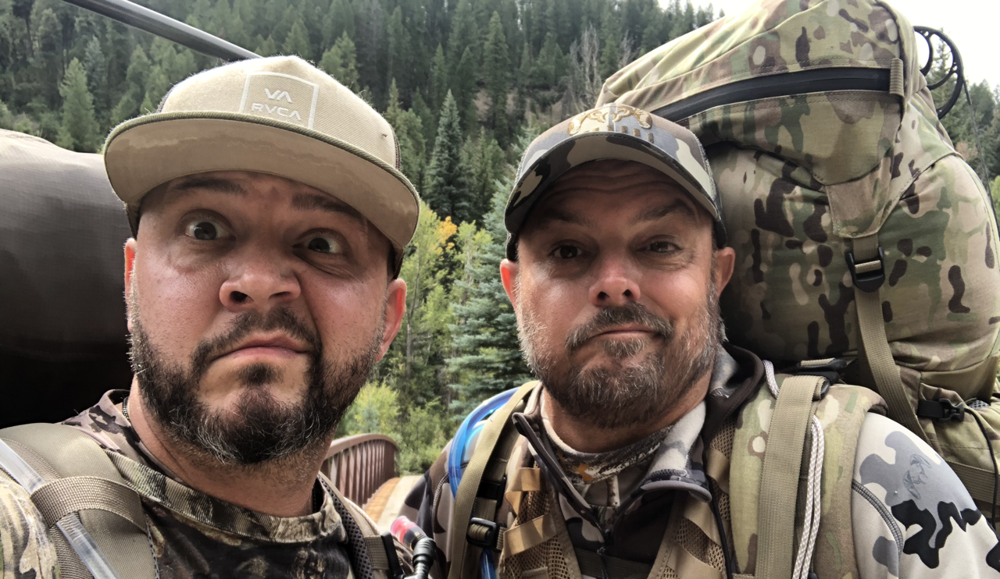

This past September, my friend JD (on the left) and I traveled to Colorado and went on our first ever backcountry, backpacking elk hunt. There were a LOT of firsts for both of us on this trip. I had hunted elk before, but had never hunted them with a bow. My friend had never hunted elk before at all, let alone with a bow. Neither of us have any experience with backpacking, so this was our first overnight, multi-day backpacking trip ever. For that matter, it was really our first backpacking trip ever too, unless you count the occasional trail hike or run with a lightweight backpack on, which I am not counting. We went to an area that neither of us had ever been into, so it was our first time there, so that was yet another first for us.

While, sadly, we neither saw nor heard any elk during the course of our trip, let there be no doubt, we had a fantastic time, and both of us absolutely _can't wait_ to get back out there and get after it again. We thoroughly enjoyed ourselves, and we learned a TON of lessons while we were out there, which, ultimately, was the whole purpose of our trip this year. Don't get me wrong, we would have loved to have brought home some meat. But we knew going into it that we were working on a shorter-than-usual timeframe for a trip like this, so we had made it a goal to do what we could, learn some things, and make sure that the next time would be even better. I am 100% certain that we absolutely accomplished that goal. Some of the lessons we learned were little things, and not all that big of a deal; but some others were much more significant, and are definitely mistakes that we intend and hope to never make again.

This article is _long overdue_, to the point where I hope it's not too late. My intent is for this to be the first in a series where I document and share some of the details from the lessons we learned. I'm doing this for a couple of reasons: first, to try to help myself to remember them, so as to hopefully not repeat them, and second, to hopefully perhaps help someone else out there learn from the mistakes we made.

In addition to things that went _wrong_, I would like to also share some of the details of many of the things that worked out really well for us. It wasn't all bad, and the trip was most definitely not a failure by any stretch. There were a lot of things that we took with us that worked well, and things that we did that I would absolutely do again. I hope that information helps someone as well.

These are the things that I plan to cover through the course of this series. Some of these will be things that worked out well for us, some are things that didn't work well at all for us, and a handful of them are just simple observations that were really neither good or bad, but feel worth mentioning.

* [Backpacks](/first-backcountry-backpacking-elk-hunt-lessons-learned-backpacks)
* [Tents](/first-backcountry-backpacking-elk-hunt-lessons-learned-tents)
* [Sleep System](/first-backcountry-backpacking-elk-hunt-lessons-learned-sleep-system)
* [Water Filtration System(s)](/first-backcountry-backpacking-elk-hunt-lessons-learned-water-system)
* [Electronics / Software / Mapping](/first-backcountry-backpacking-elk-hunt-lessons-learned-electronics-software-and-navigation)
* Reading Maps and Electronic Scouting  _(up next)_
* Food _(coming soon)_

I hope you enjoy this series, and that you're able to find something in it that can maybe help you in your own future backcountry adventures.
