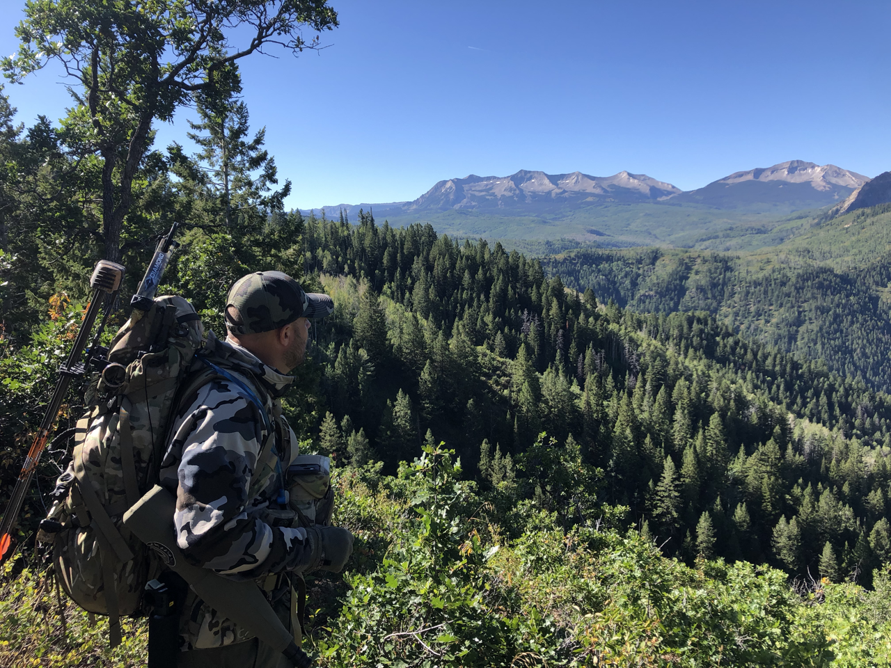
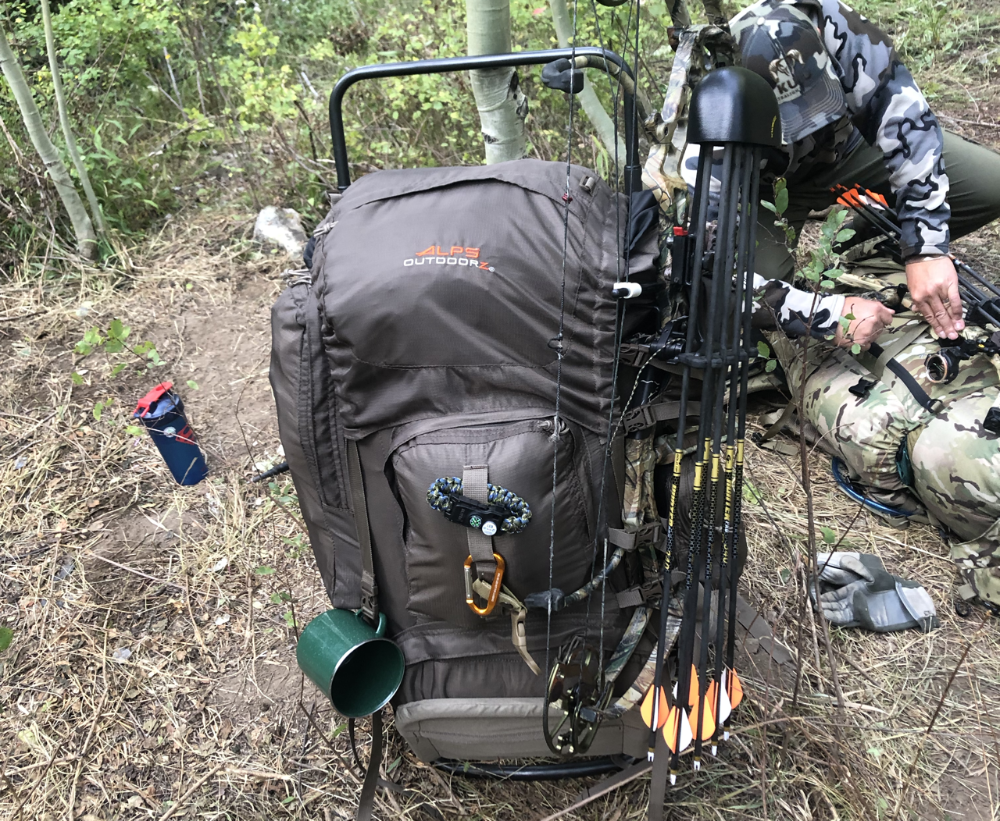

_This is the second post in a series on lessons I learned on my first backcountry backpacking elk hunt. [The previous post, which was the intro to the series, can be found here](/first-backcountry-backpacking-elk-hunt-lessons-learned-intro). [The next post after this, which focused on tents, can be found here](/first-backcountry-backpacking-elk-hunt-lessons-learned-tents)._

I started researching packs for backpack hunting probably close to a couple of years ago. I’ve had an [Eberlestock X2](https://eberlestock.com/products/x2-pack) for a few years now, and it’s a really nice pack, and works really well for a day pack, but it was clear that it would never be sufficient for a multi-day backcountry hunt.  I researched all of the names that come up when searching for backpack hunting packs, including [Eberlestock](https://eberlestock.com/), [Mystery Ranch](https://www.mysteryranch.com/), [Exo Mountain Gear](https://exomtngear.com/), [Kifaru](https://kifaru.net/) and [Kuiu](https://www.kuiu.com/) (I have since learned of [Stone Glacier](https://www.stoneglacier.com/) as well, which didn’t get considered because I simply didn’t know about them at the time, but seem like they could potentially be a good option as well, now that I know about them). The most challenging part of the process was the fact that I don’t live out west, so there was no place near where I live where I could evaluate any of these packs in person. I wasn’t able to put my hands on them, see them, touch or feel them, try them on, nothing like that. So I had to rely solely on information that I was able to find on the internet, which pretty much included a bunch of YouTube video reviews, forum discussions and social media opinions. There's plenty of information available out there, but nothing beats real-life, in-person, hands-on evaluation of a product.

Ultimately, I ended up going with the Exo Mountain Gear K2 3500. I can’t even link to it now because they’ve since released their K3 line of packs, and don’t even have their K2 line up on their web site anymore. In hindsight, I kinda wish I had been patient enough to hold out and gotten the [K3 4800](https://exomtngear.com/collections/packs/products/k3-4800-pack-system?variant=19549189242947), but at the time I questioned whether or not it would’ve arrived before we left for our trip, and I didn’t want to risk not having a good pack with me, so I just went with the K2 3500.

I mildly regret not waiting for the K3, because they’ve made some fantastic improvements with this new line (from what I’ve seen/heard/read), but I definitely _do not_ regret going with Exo Mountain Gear. The K2 3500 that I got is a _FANTASTIC_ pack that served me really well on this trip, and I am _really_ happy with the purchase. The overall fit and balance of the pack makes it really comfortable to wear, even when stuffed to overflowing with more crap in it than I needed (but, that’s another story for another post).

Overall, I am really pleased with my Exo pack and can highly recommend it if you’re in the market for this kind of pack.

JD decided to accompany me on this trip on fairly short notice (he only had a couple of months to scrape some gear together, from next-to-nothing), and he ended up going with the [ALPS OutdoorZ Commander + Pack](https://amzn.com/B004R7L7YU). I feel like he and I would agree and describe this pack as somewhere in the neighborhood of, "not really too bad for the money, but, ya get what ya pay for." Sound about right JD?

This pack definitely got the job done for him, but there were a handful of issues with it. It had the capacity he needed and held all of his gear with no issues. I can't speak to the comfort of the pack from experience, but I do recall JD mentioning that it seemed to have some balance issues which caused some discomfort because of the physical adjustments he had to make to be able to carry it effectively under heavy load. We had our bags pretty much stuffed about as full as we could get them, and this put tension on the bags of our packs. The ALPS bag started to tear in a couple of places near where the bag was attached to the frame with pins. This fortunately didn't end up being disastrous, because none of those points ended up tearing _completely_, but if it had, that could've made some real issues for us. I feel like we got lucky there.

Unfortunately I think the most significant drawback of the ALPS pack in general was one that is not even really a fault of the pack, but rather something that it just wasn't designed for. Notice in the picture above, when we were planning on extended trekking, we strapped our bows to our packs in order to free up our hands to hike with our trekking poles. The only option for strapping a bow to the ALPS pack was on the side of it, which really threw off the balance of the load. The ALPS pack just wasn't designed for that kind of function. The Exo on the other hand, was designed specifically for this kind of use, and so strapping a bow to it directly was very natural, and the result was still an extremely well-balanced and comfortable pack. Of course it's a much more expensive pack, but for very different reasons, as with the ALPS pack, you get what you pay for (IMHO).

In the end, the lesson learned here with regard to the packs we used is that, while you can certainly make do with a reasonably priced pack, the additional cost of the packs available out there that have been specifically designed for this activity (backpack hunting, performing well under heavy load) are well worth the money. I could definitely see how the difference could potentially cost you time in the field pursuing game, which could very well ultimately cost you a once-in-a-lifetime opportunity. For my part, I'd say, take some extra time, save some extra money, and get one of the good ones.
