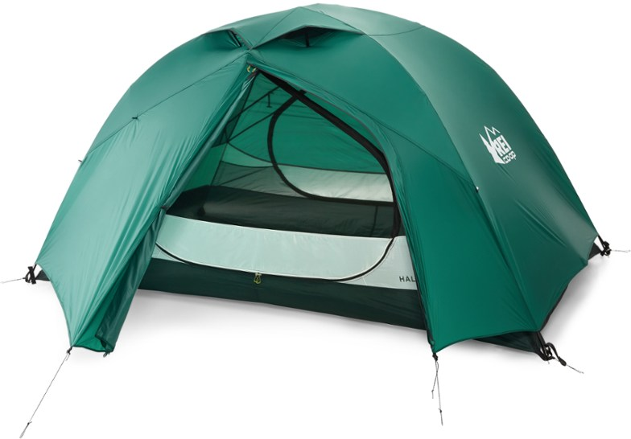

_This is the third post in a series on lessons I learned on my first backcountry backpacking elk hunt. [The previous post, which focused on backpacks, can be found here](/first-backpacking-elk-hunt-lessons-learned-backpacks)._

## A Little Backstory...

As I mentioned in [the intro to this series](/first-backpacking-elk-hunt-lessons-learned-intro), this was my first experience ever on a multi-day, backcountry backpacking trip of any kind. I did _a lot_ of research into this stuff over the course of probably close to two years leading up to it, on all kinds of things. One of the biggest, high-level lessons that I've learned though, was how truly naive I was about so many things as I did my research, and made decisions on what gear I was going to get and use for this trip.

One of the things I kept hearing and reading about all over the place was this idea of some backpackers being what was often referred to as "ounce counters." This was a term that meant that they literally counted every ounce and did whatever they could to eliminate every ounce they could from their pack weight. During the course of most of the time I was doing this research and preparing for this hunt, I was doing my best to get myself into the best physical shape that I could. For that reason, I often scoffed at this idea of being an "ounce counter", as I kept telling myself that I'd rather prepare myself to be in good enough shape that a handful of mere ounces here or there wasn't going to be all that big of a difference in the end.

Make no doubt about it, for my age and the shape that I was in when I started training for this hunt, I feel like I ended up in pretty solid shape in general. However, despite that, I found that ultimately this perspective of mine was...hhhmmmm...I guess the best way to put it would be _slightly off base._

I'm not sure I'd go so far as to say that I was necessarily _wrong_, per se, but I _have_ come to a place where I can now absolutely, very clearly understand the perspective of an "ounce counter" much better. It totally makes sense to me now to put considerably more emphasis and thought into how much the various things I carry with me into the field weigh, and where I can save myself some weight, and in-turn, energy and steps on my hikes.

Hopefully this little piece of perspective will help shed some light on my thoughts here on our tents...

## Oh right...I'm supposed to be talking about tents

Given that preface, you might be thinking that I'm about to start bashing on the tents that we took with us. While I have a little bit of critique for them, I am most definitely not going to be bashing on them. On the contrary, I'm a big fan of the tents that we used on this hunt, and JD was too.

I took with me an [REI Co-op Half Dome 2 Plus](https://www.rei.com/product/128692/rei-co-op-half-dome-2-plus-tent), and I really liked it. I got it on a black Friday sale in 2018 for nearly 50% off at just under $130. It was tough to beat for the price that I got it for. This tent had more than enough room for me _and_ my gear, and was very comfortable, with, as you can see in the image above, a pretty large ingress/egress making it plenty easy to get in and out of. It was easy enough to setup, and seemed to be more than sufficiently durable.

I can't speak authoritatively to it's performance in inclement weather, as the weather we had on our trip was mild at best. It was downright hot for most of the week during the daytime, and at night I doubt it got below the mid-30s at worst. There was little-to-no wind to test that aspect of the tent, so, as I said, I really can't vouch for it there, but all of the reviews I've seen and read about it would suggest that it would perform just fine in inclement weather.

## The lesson

My takeaway with regard to this tent is this: while this is a really nice tent, and it served me well on this trip, I can definitely do better.

According to the specs for my tent on the REI web site, this tent comes with a "minimum trail weight" of just 2 ounces shy of five pounds. Contrast that with a number of the ultralight backpacking trekking-pole supported tents available on the market today, most of which come in _under two pounds total weight_, and the simple math shows that I could shave not just ounces but _three or more **pounds**_ of pack weight by upgrading to one of those tents (which, by the way, I fully intend to do before my next trip).

Another area that could be improved, every bit as significant as the tent's weight and perhaps even more, is it's overall _bulk._ This pack took up _a lot_ of space in my pack. No matter how much time I tried to put in to compressing it down as much as possible when I packed it up, there was only so much I could do. There's just a lot more to this tent than one of the ultralight trekking pole tents available. The tent body itself, plus a rainfly, plus a footprint (arguably, I could've done without this, and may well do so in the future, but I had it with me on this trip), plus poles and stakes.

Finally, all of the things that make up this tent, along with it's bulk, add to the effort involved in setting it up and taking it down. During the course of our trip, once we setup camp, we never moved it. There were a number of reasons that went into why we never moved camp, but one of those reasons was that I had no desire to try to break down my tent and try to pack it up and cram it all into my pack unless we were heading out of the backcountry. Any number of arguments could be made as to why this was the case, not discounting the possibility of plain ole laziness, but ultimately, that was just something I didn't want to do because of the amount of effort it would've taken.

By contrast, an ultralight, trekking-pole supported tarp-style tent, based on what I've seen and read in my research, can typically be setup and taken down in less than 5 minutes, and would take up dramatically less space in my pack. I would count all of these considerations as a fairly significant collection of reasons to upgrade my backpacking tent to improve my overall experience.

In conclusion, I'd like to wrap up by thanking all of the ounce counters out there who keep on fighting the good fight. I have seen the light, I get it now. I am currently saving up for an ultralight trekking-pole style tent that I hope to get sometime this year (currently leaning toward the [Seek Outside Silex](https://seekoutside.com/silex/), though I'm still undecided on whether to go with silnylon or DCF (the ultralight model)). At the same time, I do expect to have my REI Half Dome 2 for a long time. It'll make a great option to share with my kids as I hope to get them into backpacking with me in the coming years.
