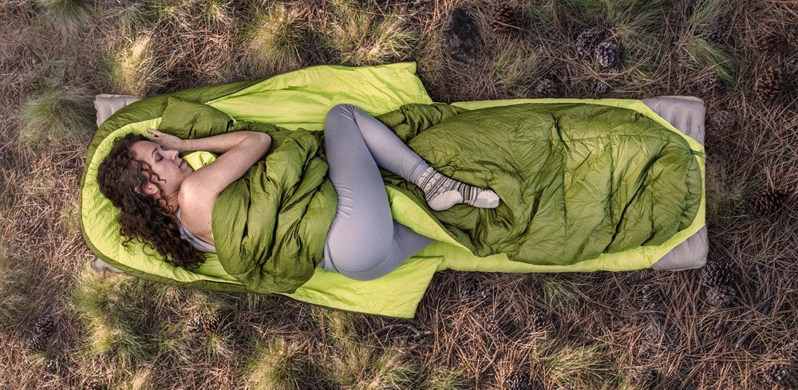
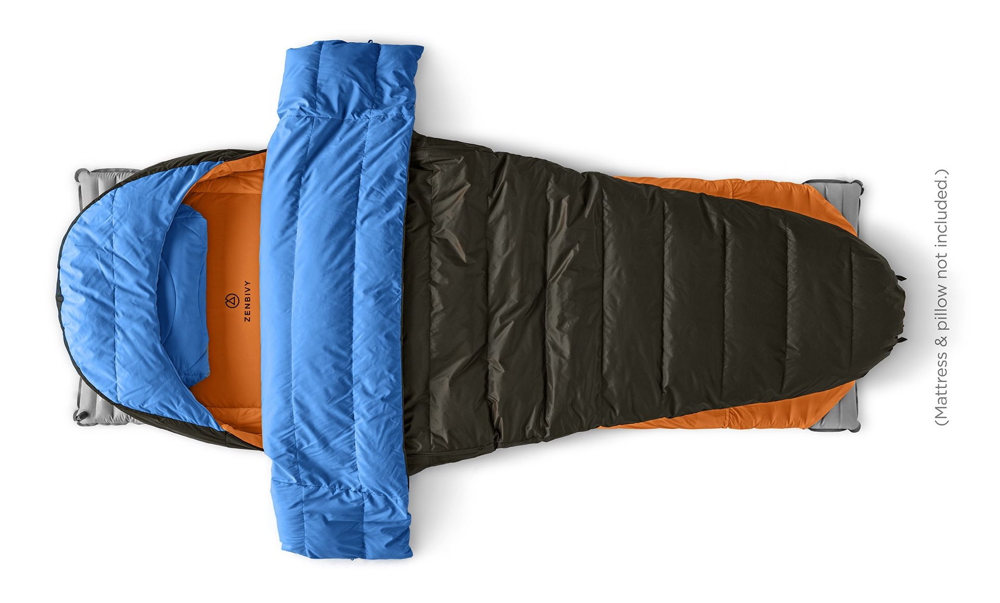
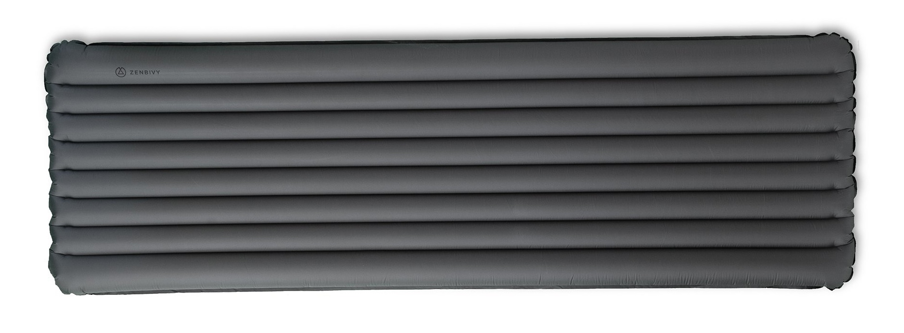
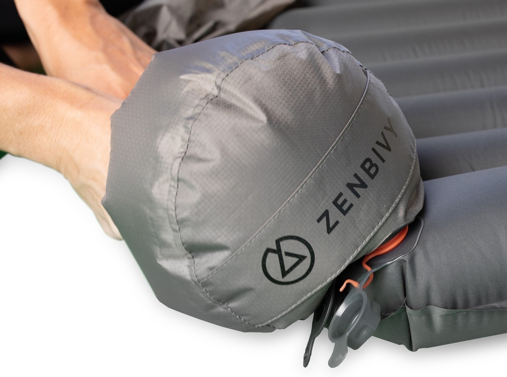
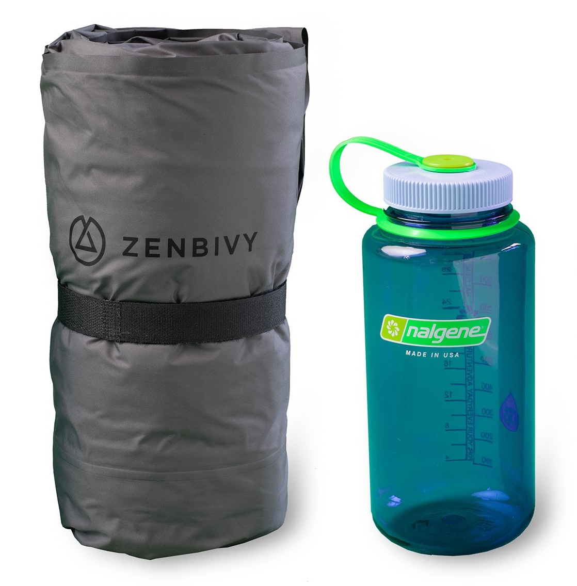

_This is the fourth post in [a series](/first-backcountry-backpacking-elk-hunt-lessons-learned-intro) on lessons I learned on my first backcountry backpacking elk hunt. [The previous post, which focused on tents, can be found here](/first-backcountry-backpacking-elk-hunt-lessons-learned-tents). [The next post, which is focused on my water system, can be found here](/first-backcountry-backpacking-elk-hunt-lessons-learned-water-system)._

I am a side/stomach sleeper. Always have been, and I don't see that fact changing anytime soon. At some point, that decision is subconscious and happens in your sleep, so you have very little control over changing it.

But it's this very reason that has always made it a challenge for me to sleep effectively when camping. I've slept in my share of mummy bags, and it's never resulted in a good night's sleep for me. I just simply can't get comfortable in them with the way my subconscious is used to trying to position my body when I sleep.

So I put a lot of time and energy into researching sleep systems in preparation for this trip, and based on the result, I'm really glad that I did.

## An aside about the (not so) evils of targeted ads...

There's been a lot of talk across the internet recently regarding users' privacy and things of that nature. I'm still a little bit on the fence about the whole subject to be honest. On the one hand, I'm not super crazy about the idea of companies being able to scrape whatever kind of information they want about me and sell it to the highest bidder. That's actually just a little creepy if you ask me. On the other hand, I understand that the people running various web sites have to be able to make money somehow, and for that reason, ads are here to stay, and they're just flat out not going away anytime soon. So, if I have to see ads when I'm using the internet, I feel like I might as well be seeing ads that are at least related to things that I might actually be interested in, right?

Anyway, what in the world does this have to do with my sleep system on this hunt? That's a fair question. The answer is, it was in an Instagram targeted ad that I first learned about [Zenbivy](https://zenbivy.com/)...

## Not so fast...

When I first saw and read about [Zenbivy's "bed"](https://zenbivy.com/pages/original-zenbivy-bed), I was fairly impressed with how they described it. It sounded to me like a pretty interesting and innovative system that would actually give me what I was looking for...a sleep system that would allow me to be able to comfortably sleep on either my side and/or stomach in the backcountry.

My concern was, it seemed like a fairly new-ish company, and I had trouble finding much in the way of practical use reviews anywhere around the internet, so I was concerned about the lack of proven reliability.

Because of this, I ended up trying out a more well-known brand first. I ordered the [Sierra Designs Backcountry Bed](https://sierradesigns.com/backcountry-bed-700-20-degree/). There are a lot of really great reviews on this sleeping bag out there, and it comes very highly recommended. However, when it arrived in the mail, the first thing I did was set it up on my sleeping mat (I'll get to that here in a little bit) on the floor in my living room. I tested it out by tossing and turning in it and trying to get comfortable, but unfortunately, I just _could not_ get comfortable in it at all. Here's why...

The picture above is about the closest I can find to how I more often than not end up laying when I sleep. Specifically, notice how she has her right leg hiked up like that? I do that almost every night when I sleep. The only difference is, I am often rolled over even more on my stomach than on my side like she is.

Well, in the Sierra Designs Backcountry Bed, I was not able to comfortably get my leg hiked up like that. Despite it's shape, it still wasn't wide enough for me to be able to comfortably lay the way I most often do, and for that reason, I was sure that I was going to have trouble sleeping well in it. This is exactly the problem I've had with nearly every mummy-style sleeping bag I've ever tried sleeping in.

Ssooo because that bag didn't work out the way I had hoped, I went ahead and sent it back, which put me right back to square one, trying to decide what I was going to sleep in. At this point, having not found anything else that seemed like it would be a good "fit" for the way I sleep, I decided to go ahead and give the Zenbivy bed a shot. Man I am so glad I did.

## The Zenbivy Bed and Light Mattress

I finally ended up with the [Zenbivy Light Mattress](https://zenbivy.com/pages/zenbivy-light-mattress) for my sleeping pad, and the [Original Zenbivy Bed](https://zenbivy.com/pages/original-zenbivy-bed). As long as I was going with those, I figured I should probably just go all in and so I went ahead and ordered their [Light Pillow](https://zenbivy.com/collections/pillows/products/zenbivy-light-pillow) as well (I bit the bullet and decided to go ahead and carry the extra three ounces).

This turned out to be a _**really nice system**_ that I am SUPER happy with. For the bed, I went with the XL (30"x80") size just to be sure that I would end up with enough room to move in it, and I got the 29&deg; synthetic bed (as opposed to down...we'll talk a bit more about that below). As for the mattress, I got the 25"x77" one. These two items worked really well together, and proved to be a SUPER comfortable sleep system that I slept exceptionally well on in the backcountry.

One really nice convenience of the light mattress was that it comes with a dry bag that you can put it in that doubles as an inflation bag. Other products out there have similar systems, but I was really pleased that this mattress came with one as well. This is WAY nicer and more efficient than blowing up an inflatable sleeping pad manually (and saves some cheek and jaw fatigue).

Despite the impressive R5 insulation value of this mattress, you can see in the image below that it compresses down fairly impressively. I had actually gotten their [Flex Mattress](https://zenbivy.com/pages/zenbivy-flex-mattress) at first, but felt like it was considerably more bulky than I wanted to have to carry with me, so I exchanged it for the Light Mattress. As you can see, the compressed size of the Light Mattress is pretty impressive for what you get from it. Overall, I am very pleased with it, and can highly recommend it.

The only critique I have with this system is partially due to my own personal preference. I made a personal choice to go with the synthetic bag over the water-resistant duck down bag. That choice was intentional, but it resulted in a little bit of a bulk issue with the bag/bed itself. The synthetic bag definitely does not compress down as compact as the down bag does, and that cost me some space in my pack. I'm still super happy with the bag, and the compression is reasonable, so it's a sacrifice that I am willing to make.

Synthetic bag compression aside, overall I am really pleased with having gone with Zenbivy. I am super happy with this sleep system, and expect it to be one that will serve me well for years to come. I can personally, highly recommend this setup if you're looking for a system that is lightweight, compresses well, and that you can get comfortable in if you're a stomach or side sleeper and move around a lot.
