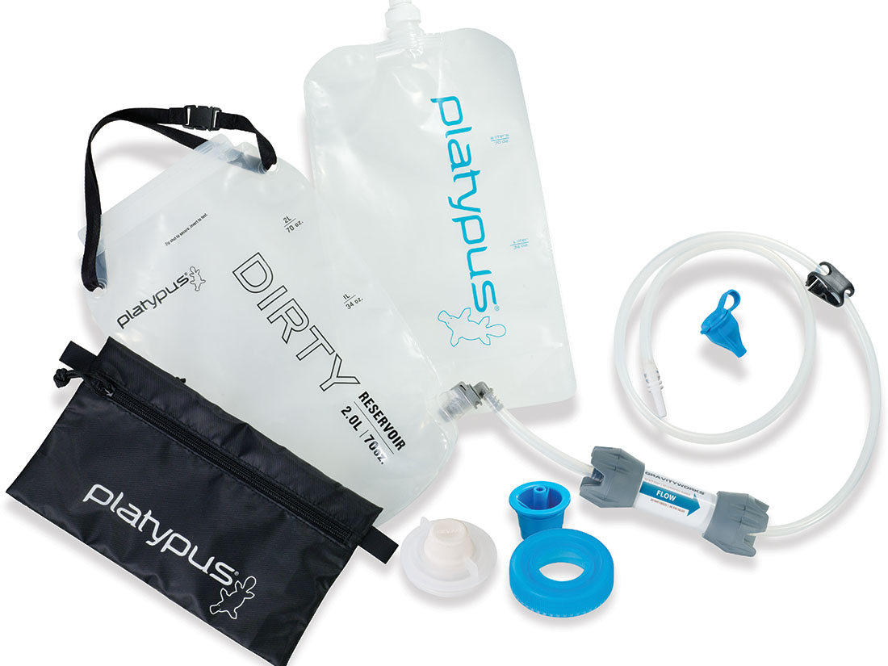
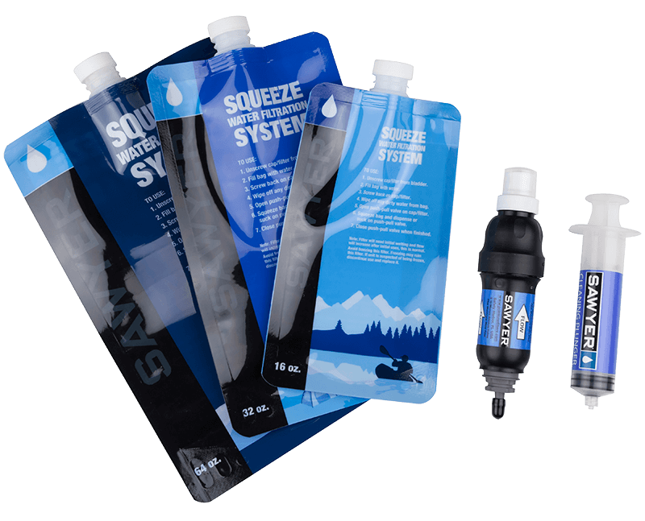

_This is the fifth post in [a series](/first-backcountry-backpacking-elk-hunt-lessons-learned-intro) on lessons I learned on my first backcountry backpacking elk hunt. [The previous post, which focused on my sleep system, can be found here](/first-backcountry-backpacking-elk-hunt-lessons-learned-sleep-system)._

When I decided to try my hand at a multi-day backpacking hunting trip, I knew that one of the first and most critical things that I would need a solution for was going to be water. Water is just essential as a human, and you have to have a reliable means of obtaining clean water when you're in the backcountry, or you're not going to be there for long.

I'm happy to say that this was actually one of the things that went really well for us on this trip. We ended up finding more than enough water, and the systems that we used to filter it worked out really, really well for us.

For starters, I purchased the [Platypus GravityWorks 2.0 Liter Water Filter Kit](https://amzn.com/B00A9A2HKM).

I had seen this used by lots of people in lots of different videos that I watched, and you can read about it on just about any backpacking blog or web site you'll find. It comes highly recommended, and I'm not here to change that. Once you get it out into the field, it's easy to see why so many people like it so well. It's super simple to use and works really fast. We were able to filter a full 2 liter dirty bag in probably less than two minutes (it's been a while, I don't recall exactly, and didn't really time it, but, IMHO it's sufficient to say it was more than acceptably fast).

The _only_ critique that I have for this system is very minor, and that is that I'd consider it a bit on the pricey side. This system costs roughly $100 depending on where you buy it. However, considering what you get for it, and the fact that well, we're humans, and we _need_ water to survive, it's worth the cost in my opinion.

As a matter of fact, _the only reason_ I would consider it pricey at all, is because in addition to it, we also brought along the [Sawyer Squeeze Filter System](https://sawyer.com/products/sawyer-squeeze-filter/) as well. This kit came with two 32oz dirty bags, a filter with several different adapters, and it only costs right around $20 for the kit. [Sawyer also has their own gravity filter system with a One Gallon dirty bag that only costs $40 on Amazon](https://amzn.com/B06XZVBSMX) (and it seems to get pretty good reviews too, so, you may wish to check it out).

The Sawyer Squeeze Filter system _does_ require a little bit more work, as you have to fill the dirty bag and squeeze the water through the filter into your clean bag (in our case, we squeezed it directly into our water bladders), but that was a minor inconvenience in my opinion, and only costs you a little bit of time. I think it took us somewhere around 10 minutes or so to squeeze 3 liters of water into our packs with this system, and it was 10 minutes that we need a break for anyway, so the inconvenience was minor at best.

These two water filtration systems worked out _really_ well for us, and I can highly recommend both of them. If you're looking to get into backpacking or backcountry hunting and need a water system, both of these systems will get the job done for you exceptionally well.

## Bonus lesson: Tenacious Tape is _awesome_

This didn't seem to fit well into any of the top-level subjects that I was planning on covering in this series, so this felt like the most appropriate place to put it. It should make sense why by the time I'm done here.

One of the video series I watched a number of times in preparation for this hunt was the [Land of the Free series](https://youtu.be/E-wCZx6InKY) by the [Born and Raised Outdoors](https://www.youtube.com/channel/UCubQp7PzYsUKV5K4J-f9mig) guys on YouTube. I honestly can't remember if it was one of the videos in that original series of theirs or another one, but in one of their videos, one of the guys made mention of [Tenacious Tape](https://www.rei.com/product/783045/gear-aid-tenacious-tape-repair-tape). During one of my gear shopping trips to REI I saw some on the shelf, and it was only $5, so I picked up a pack of it.

At some point during the first day of our trip, somehow or other, our Platypus clean bag got punctured by something and sprung a leak. So I dug into my pack and pulled out the Tenacious Tape, cut a small circle out of it, dried off the area around the puncture on the clean bag and slapped that little patch of tape on there. We gave it a few minutes to set before we tried doing anything else with it, but honestly, we never had to think about it again. It was as if it had never gotten punctured at all. That Tenacious Tape patched it up like new. I was SUPER impressed, and really glad to have picked some up and brought it with me. Hat tip to Trent from [Born and Raised Outdoors](https://www.instagram.com/bornandraisedoutdoors/) for the recommendation. Much appreciated Trent!
