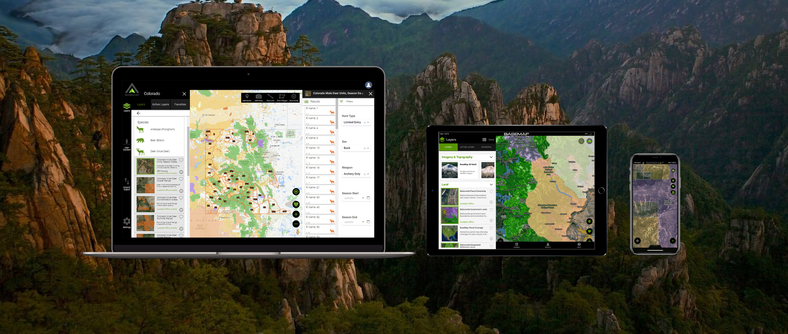

_This is the sixth post in [a series](/first-backcountry-backpacking-elk-hunt-lessons-learned-intro) on lessons I learned on my first backcountry backpacking elk hunt. [The previous post, which focused on my water system, can be found here](/first-backcountry-backpacking-elk-hunt-lessons-learned-water-system)._

This post turned out to be quite a bit more lengthy than I had originally thought it would be. If you'd like the TLDR version, here it is: [The Garmin inReach Mini](https://buy.garmin.com/en-US/US/p/592606) is awesome and totally worth the cost. [Basemap](https://www.basemap.com/) is a fantastic mapping and navigation solution for your hiking, backpacking and hunting needs. Finally, always, _always_ make sure you have a backup solution for these critical resources, or it could cost you time in the field.

Now, if that has you intrigued or if you're interested in the full story, read on for more on those three overall topics...

## Satellite Communication

The area where we hunted last fall is an area that I've hunted before a few times during rifle season. It's a wilderness area of Colorado that is one of the most remote parts of the state, and there is absolutely no cellular coverage anywhere near the area where we were hunting. Our hunt last year was very different than any that I had been on before. When I'd been rifle hunting in the area previously, we'd been hunting out of a basecamp that we returned to each night, and there was always at least a half-dozen of us in camp, and we all communicated with two-way radios for safety purposes. By contrast, on our hunt last year, hiking deep into a wilderness area with camp on your back, and only two of us doing it, presented a unique and elevated set of risks that made having an option for communicating with family, friends and/or emergency services something that I personally put into the category of necessity.

I researched a number of options for filling this need, and I ultimately decided to go with the [Garmin inReach Mini](https://buy.garmin.com/en-US/US/p/592606), and was really happy that I did. This little device gave us exactly what I wanted from a device like this, and did so with very little friction.

### _The Good_

This thing is super small and light: less than 4 inches tall (including the antennae) and only two inches wide, and it only weighs 3-and-a-half ounces. For the features this device gives you, it's almost unnoticeable to carry, it's pretty awesome. For me, the thing that I think I liked most about this device is that for the most part, it's really just a hardware interface to the satellite grid for communications and data. You pair the device with a smartphone via bluetooth, and interact with it using [Garmin's Earthmate app](https://play.google.com/store/apps/details?id=com.delorme.earthmate). Whether directly through the device (which is possible, albeit a little bit slow and clunky), or via the Earthmate app (the _much better option_ IMHO), you can send and receive standard SMS text messages ([via subscription through Garmin](https://explore.garmin.com/en-US/inreach/#subscriptions)), check weather reports, download and navigate with maps, tracks and waypoints, and even send an SOS signal to interact with emergency rescue services in cases of emergency.

The battery life was fantastic. We never had to recharge the device the entire time we were out (although, as we'll discuss in a bit, we weren't out there as long as we had initially intended). I didn't actually use the device for location tracking or sharing, or for any kind of mapping or anything like that. My intention for this device was for it to strictly be for communications and emergency services as needed, so we only turned the device on a couple of times a day at most, so we barely used more than half of a full battery charge over the course of four days. I was really pleased with that kind of performance for what we wanted from the device.

### _The bummer_

I couldn't bring myself to call this section "the bad", because I can't really come up with anything I about this device that I'd consider "bad" per se. In general it's pretty great across the board, but I do have one minor critique of it. Because I wasn't using the device for always-on tracking and was only using it for on-demand comms, I typically stowed it in the pocket in the lid of my pack, and then took it out when we put it to use. I'd guess there must've been something else in that pocket with it that it got banged around with, and as a result, it came home with a minor little crack on the edge of the screen _(if you look closely at the image of it above, you can just see the small crack along the left side of the screen)_. Everything I read about these devices when I was researching them suggested that they're typicaly pretty rugged and can take their fair share of abuse, and I wouldn't call this level of damage significant, but I feel like it probably at least compromises the water resistance of the device, which is a bummer. I will definitely be taking caution in the future to added some level of protection around the device to prevent any kind of further damage. It's not an extraordinarily expensive device, but it's not the kind of investment I'd want to have to make every year either. I hope it lasts me a good long time.

I feel like I should also add that in order to send and receive messages, you have to have a subscription. Money is a relative thing, but from this workin' man's perspective, the subscriptions aren't cheap. Don't get me wrong, it's worth the cost, and it won't break the bank, but it's definitely not cheap. I went with the Personal "Recreation" "Freedom" (one-time (not annual)) subscription plan, as I only planned on using it during our trip. With tax and everything else, it ended up costing just under $45 for it. Not bad ultimately, but that only came with 40 messages (that includes both sending _and_ receiving). We only planned on using it for sending messages once a day to check in with family. In the end, it was pretty surprising how fast 40 messages got used up. I actually ended up going 1 over, so was charged extra for the one message. Not really a big deal, but for our next trip, I definitely plan on stepping up the plan I subscribe to. Just something to keep in mind if you're considering it.

### Overall...

The Garmin inReach Mini was everything I wanted for what I purchased it for, and am very happy with it, and would definitely recommend it.

## Mapping and Navigation

While the Earthmate app supports mapping and navigation features, there are a number of much better options available for this task (sorry Garmin, but you've got a ways to go in this regard). If you've been exposed to big game hunting at all within the past five(ish) years, you're almost certainly familiar with [On X Maps](https://www.onxmaps.com/). You may also have heard of [Basemap](https://www.basemap.com/) as well. One that I've used and liked for years is called [Gaia GPS](https://www.gaiagps.com/). I've put them all through their paces.

A little aside here...a few months before our trip last year, I was in need of a new cell phone. My old iPhone SE was showing it's age, and the battery was completely shot, so I knew I was going to need a new one before our trip. I won't go into the reasons for the decision why other than it ultimately came down to price, but I ended up switching from an iPhone to a Google Pixel phone, so had to make the switch from iOS to Android. I mention this, because it ended up making a fairly significant difference in my choice of mapping applications here.

So, I mentioned above that I had used and really liked Gaia GPS for quite some time. In fact, I've used it for several years, and I really like it and can highly recommend it. However, unfortunately, when I made the switch to Android, I discovered that Gaia has some UI issues on that platform that were enough to push me to check out other options.

I won't get into any details here, but I've had some issues with On X maps in the past that left a bit of a sour taste in my mouth, so I didn't really consider that option much at all. This left me to try to put Basemap through the ringer to see if it could be the app that I was looking for. I'm thrilled to be able to say that Basemap turned out to be everything I was hoping it would be, and then some.

### _The Good_

Basemap gave me everything I was looking for in a mobile mapping and navigation application. Primarily what I wanted was the ability to do my electronic scouting and planning from my desktop where I could use the screen real-estate of my desktop computer to analyze maps, scout terrain, look for trails and hunting areas that I wanted to make sure I hit, and plan out my trip as much as possible by marking waypoints and tracks from the desktop. Then, I wanted it to be able to take that data and seamlessly sync all of that planning data to my mobile device, which it did without me having to even think about it. That synchronization was perfectly seamless. Whenever I would add any kind of waypoint or track or anything like that on the desktop, I could open the app on my phone and (as long as I was somewhere with connectivity) I would immediately see it available in the phone app. Perfect. In addition to that, as I mentioned previously, I was going to be hunting an area with no cellular service, so I _needed_ to be able to download map tiles for offline use, and basemap not only supports this, but makes it pretty simple to do.

Basemap supports dozens of different map layers for analyzing different kinds of historical and terrain data, as well as property and land boundaries and ownership info as well, all of which can be downloaded for offline use when desired. The _"and then some"_ for me was a super nice feature that I've always wanted from a mapping app like this that I was really happy to see in Basemap (though it, understandably, requires connectivity to use these features) was the ability to share not only data (waypoints, routes, etc) with "friends" through the app, but also location sharing as well. You can opt-in to sharing your location with selected people. So if/when you're hunting in an area where you have cellular service with a hunting partner that also uses the app, you can share your location with them, and be able to see where each other is at through the app when you're in the field. This is a super nice feature that Basemap offers that I've not seen in other apps (though they may have this feature and I'm just not aware of it).

### _The bummer_

The _only_ negative that I could come up with here at all is the Gaia GPS issue with the Android app. I can't think of anything about Basemap I'm disappointed with or would change at all right now. I'm very happy with it.

### Overall...

Despite the minor disappointment with the Android version of Gaia GPS, I'm still really happy with it in general and would definitely recommend checking it out, especially if you're an iOS user. The silver lining of that issue is that it pushed me to check out Basemap closer, which I've been really happy with, and I fully intend to stick with it as my go-to mapping and navigation app for the foreseeable future. If you haven't yet, you should definitely check it out.

## _Always_ have backup options

Here's where the big lesson learned comes in for us. This was one of two significant categories where we really screwed some things up for ourselves on this trip and learned some tough lessons.

First off, I knew there was no way I was going to get by using my phone for both navigation _and_ comms without having some kind of charging solution for it. So before we left I purchased a [Foxelli USB solar charger](https://amzn.com/B079DD4HHJ) to handle charging our electronic devices. I've been happy with Foxelli products in the past and this unit got good reviews, so I went with it. One thing I noticed immediately though was that the USB charging cable that I got with my Pixel phone was USB C on both ends, and this charger was standard USB A output, so it was necessary for me to get a new charging cable to be able to charge my phone, so I ordered [one of those](https://amzn.com/B01A6F3WHG) too. When each of those items arrived, I tested everything out at home well before we left, and everything worked fine and I was able to charge my phone with no issues.

OK, so, with that backstory established, let's talk about all of the things that we did wrong with regard to our electronics and mapping and navigation solution. By far, the biggest rookie mistake that we made here was that **I took sole responsibility for handling all navigation and mapping responsibilities for the trip**. Bad move. JD (the guy that was hunting with me on the trip) didn't have any mapping solution on his phone, and had not downloaded any kind of offline maps, nor did I share with him any of the tracks or waypoints that I'd been collecting for our trip. JD has an iPhone, and could easily have installed Basemap, or any other mapping solution that supports offline maps for that matter, but he didn't have any. We really needed for him to.

Second, I was also the only one that had downloaded and installed the Earthmate app for interfacing with the inReach Mini. These two poor decisions meant that if (when) anything went wrong with my phone at all, we had no backup plan or solution available in the field. That's a problem.

Alright, next big mistake. So, if you look closely at the image above, that was taken on day two of our hunt when we took a break for lunch. Day two being...on day one, we pretty much just hiked in, we didn't get in any hunting at all. So the picture above was on the following day, as we sat to eat, I setup the charger and plugged in my phone to charge up. After an hour or so of some lunch and a quick power nap, I checked the status of my phone, and was concerned to see that it hadn't charged at all. I didn't think a whole lot of it at the time, because we had to move on, we had some hunting to do, but I was frustrated that it hadn't charged.

Fast forward to that evening when we got back to camp, and there was still a little bit of daylight before dark, I took the charger to a spot with a clear view of the last bits of daylight, and tried to charge my phone again. After another hour of charging, my phone's battery wasn't charged any more at all. We had a problem. For some reason, my phone wasn't charging. JD and I went through some pretty basic troubleshooting steps and ultimately determined that, for whatever reason, the charging cable I'd ordered for my phone just for this trip, was no longer working. To this day I have no idea why it didn't work, or how it got damaged (remember, I'd tried it after having received it in the mail and everything worked fine), but it didn't work.

So, here we were on day two of what was supposed to have been a five or six day backcountry hunting trip, and we had no way to charge my phone, which was our only means of mapping, navigation and communication with the outside world, and my phone was at just under 50% batter power. _We had a problem._

In the end, we were able to squeeze another full day of hunting in to our trip, but our grave mistakes of not having appropriate backup solutions for all of this stuff ultimately ended up costing us at least two days in the field that we would've otherwise had. Now, the conditions we were hunting under were no doubt less than ideal, but as anyone whose done any kind of research into or has any experience elk hunting knows well, it only takes one elk to cross your path at any given moment that can turn a completely uneventful trip into a memory that lasts a lifetime. Our unpreparedness potentially cost us that very opportunity by stealing those two days from us.

A backup USB charging cable ultimately weighs less than an ounce and takes up almost no space in your pack. Less than an hour's worth of installing a couple of apps on JD's phone and some data sharing and syncing, and we would've had the backups we needed to have stayed out hunting for another two or three days as we had originally planned. That could well have been the difference between us coming home empty handed, and coming home with meat for our families.

Don't make the same mistakes that we did. Take some extra time and plan out some backup solutions for this kind of stuff before you head out for your trip. It could make all the difference in the world.
